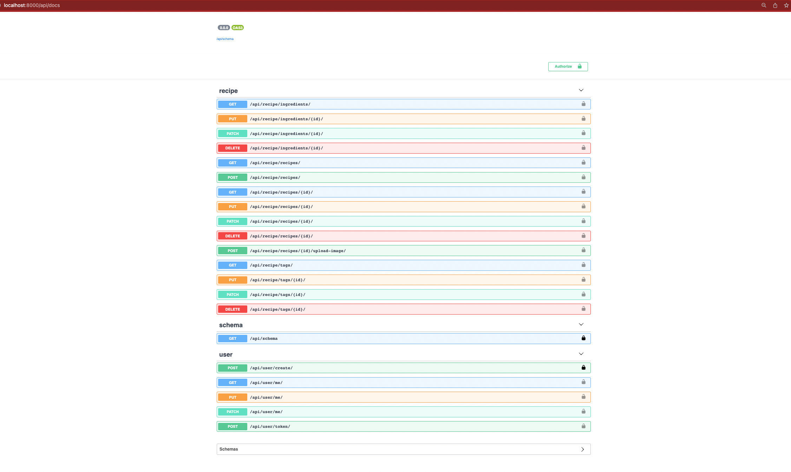

# Recipe API

## Overview

Welcome to the Recipe API project! I have developed this API to showcase my skills in the following technologies using Python, Django, Django REST Framework, Docker, GitHub Actions, Postgres, Test Driven Development Swagger&OpenAPI documentation tools. The API allows users to manage and store recipes, perform advanced filtering and sorting operations, and upload/view images associated with recipes. The project is ready to be deployed into an EC2 AWS instance.

## Project Overview
The goal of this project is to build a fully functional REST API that offers a range of features and demonstrates proficiency in backend development. Here are the key functionalities and features of the Advanced Recipe API:

- User Authentication: Secure user authentication system for accessing API endpoints and managing user profiles.
- Create and Manage Recipes: API endpoints to create, retrieve, update, and delete recipes with detailed information.
- Filtering and Sorting: Advanced filtering and sorting options for efficient searching and organizing recipes.
- Image Upload and Viewing: Ability to upload images associated with recipes and view them through the API.
- Customized Django Admin: Enhanced Django admin interface for convenient management of the API.
- Database Configuration: Integration with a Postgres database to store recipe data efficiently.

## Getting Started
To run the Advanced Recipe API on your local machine and explore its functionalities, follow these steps:

- Clone the repository to your local machine.
- Make sure you have Docker and Docker-Compose installed.
- Build and start the development environment by running docker-compose up.
- Access the API endpoints through http://localhost:8000/ in your browser or an API testing tool.

## API Endpoints
All the Endpoints, schema information, creating and retrieving tokens for users can be done through Swagger in the following url http://localhost:8000/api/docs#/.
Also, for you convenience you can try it out by authorizing into the API and trying out different Endpoints and operations.

## Test(TDD)
In this project the Test Driven Development is applied. The tests are in place for every endpoint and it's functionalities. Including tests for admin user, commands and models. They are configured to be executed every time someone pushes to Git and run through Git Actions. 